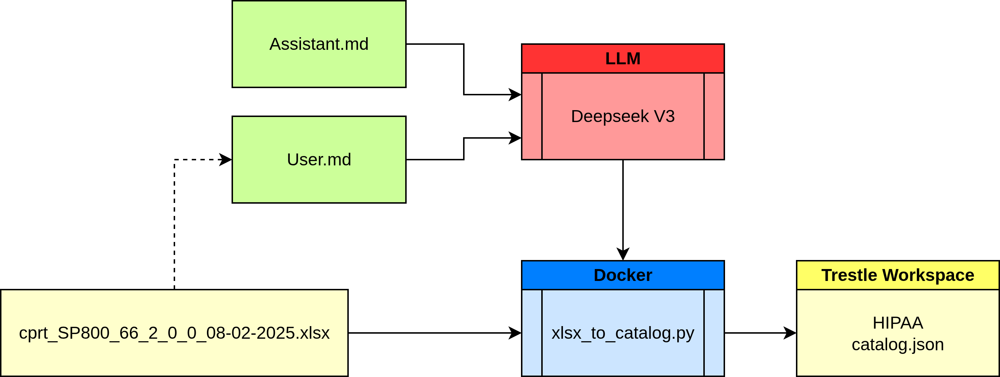

# Health Insurance Portability and Accountability Act (HIPAA)



##### 1. Markdown files for assistant and user prompts

- [catalog_assistant.md](prompts/catalog_assistant.md)
- [catalog_user_hipaa.md](prompts/catalog_user_hipaa.md)

##### 2. LLM generated python code

- [xlsx_to_catalog.py](work/xlsx_to_catalog.py)


##### 3. Docker file to employ generated python code

- [Dockerfile](Dockerfile)

##### 4. Source xlsx file

- [cprt_SP800_66_2_0_0_08-02-2025.xlsx](data/cprt_SP800_66_2_0_0_08-02-2025.xlsx)

##### 5. Generated OSCAL catalog

- [catalog.json](trestle.ws/catalogs/hipaa/catalog.json)

##### 6. Validation check of generated OSCAL catalog

```
trestle validate -f catalogs/hipaa/catalog.json

VALID: Model /home/degenaro/git/compliance-trestle-demos/ai_hipaa/trestle.ws/catalogs/hipaa/catalog.json passed the Validator to confirm the model passes all registered validation tests.
```

##### 7. Console

```
make
rm -f trestle.ws/catalogs/hipaa/catalog.json
Start HIPAA: 2025-09-12 05:51:32
Skip llm
mkdir -p trestle.ws/catalogs/hipaa; \
docker build -t my-image .
docker run --name my-container my-image
docker cp my-container:/app/data/catalog.json trestle.ws/catalogs/hipaa
docker stop my-container
docker rm my-container
STEP 1/7: FROM python:3.11-slim-buster
STEP 2/7: COPY requirements.txt .
--> Using cache fae133982a532cd4c4e6c68ec87134418a92b921a41e7731f274e65beedc194b
--> fae133982a53
STEP 3/7: RUN pip install --no-cache-dir -r requirements.txt
--> Using cache b18cccba4776097c0387459f1dd48c8eb154ff43f4b6ecdb39bd770964b8d070
--> b18cccba4776
STEP 4/7: WORKDIR /app
--> Using cache c2fafb928d9aafa91d7bf56b3d4bfe3b32e0a46e809b0e3e187da1ccc45a4919
--> c2fafb928d9a
STEP 5/7: COPY work/xlsx_to_catalog.py /app/work/xlsx_to_catalog.py
--> Using cache bc9ec14766ed5e98b31fe8e365d7f659b5a6b0262ed4993d58bdbf20c135c253
--> bc9ec14766ed
STEP 6/7: COPY data/ /app/data/
--> f04f96e65c66
STEP 7/7: CMD ["python", "work/xlsx_to_catalog.py", "--input", "data/cprt_SP800_66_2_0_0_08-02-2025.xlsx", "--output", "data/catalog.json", "--title", "HIPAA Cybersecurity Resource Guide", "--version", "2.0.0", "--oscal-version", "1.1.3"]
COMMIT my-image
--> cada41d79f99
Successfully tagged localhost/my-image:latest
cada41d79f993ef65a0b38a246fc04695ac7720c5a22a3d4d17d2f405247d66a
my-container
my-container
source /home/degenaro/venv.oscal-agentic/bin/activate; \
cd /home/degenaro/git/compliance-trestle-demos/ai_hipaa/trestle.ws; \
trestle validate -f catalogs/hipaa/catalog.json

VALID: Model /home/degenaro/git/compliance-trestle-demos/ai_hipaa/trestle.ws/catalogs/hipaa/catalog.json passed the Validator to confirm the model passes all registered validation tests.
End HIPAA: 2025-09-12 05:51:36
```