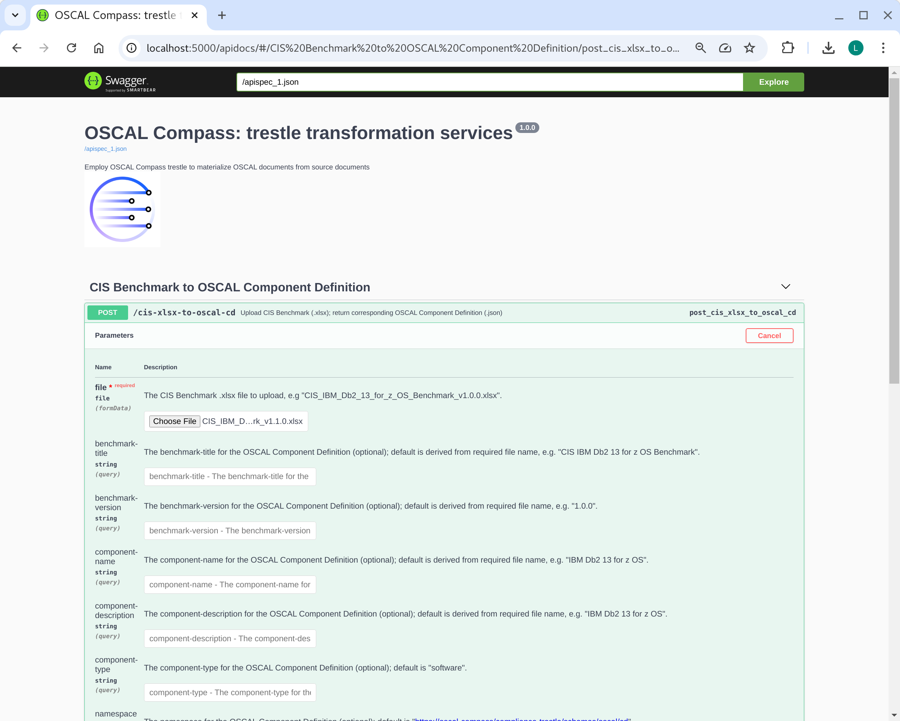
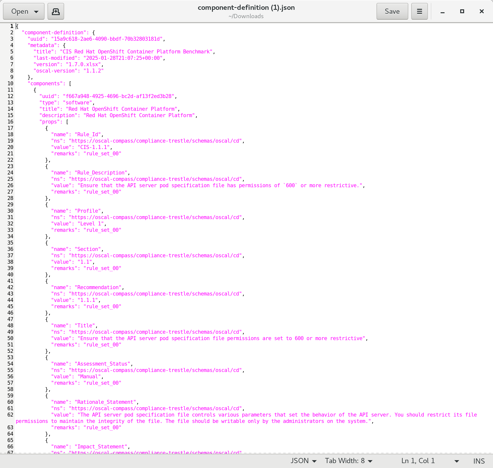

# compliance-trestle-task-cis-xlsx-to-oscal-cd-demo

Simple example of using trestle to facilitate building an OSCAL component-definition from a CIS benchmark (.xlsx)

## Prerequisites

Download this repo

```
> cd
> mkdir git
> cd git
> git clone https://github.com/IBM/compliance-trestle-demos
> cd compliance-trestle-demos
```

### Swagger demo

```
> make
=> create python virtual environment
=> install prereqs
echo "=> launch flask"
source /tmp/venv.trestle/bin/activate
python apps/trestle-services/app.py

=> launch flask
 * Serving Flask app 'app'
 * Debug mode: on
WARNING: This is a development server. Do not use it in a production deployment. Use a production WSGI server instead.
 * Running on http://127.0.0.1:5000
Press CTRL+C to quit
 * Restarting with stat
 * Debugger is active!
 * Debugger PIN: 142-906-892

```

```
In web browser, enter: http://localhost:5000/apidocs/

- click on POST
- click on "Try it out"
- click on "Choose File"
- navigate to: git/compliance-trestle-demos/CIS_IBM_Db2_11_Benchmark_v1.1.0.xlsx
- click on Execute (blue bar)
- click on "Download file"
```



<br>
<br>




### Command line demo

Install compliance-trestle, ideally in a python virtual environment.

```
> python -m venv venv.compliance-trestle-demos
> source venv.compliance-trestle-demos/bin/activate
> pip install compliance-trestle
```

Running the demo

```
> mkdir trestle-workspace
> cd trestle-workspace
> trestle init
> trestle task cis-xlsx-to-oscal-cd -c  ../cis-xlsx-to-oscal-cd.db2.snippet.config
input: /tmp/tmp5qpd6r_x/CIS_IBM_Db2_11_Benchmark_v1.1.0.snippet.csv
output: component-definitions/CIS_IBM_Db2_11_Benchmark_v1.1.0/component-definition.json
Task: cis-xlsx-to-oscal-cd executed successfully.
```

Viewing the result

```
> cat component-definitions/CIS_IBM_Db2_11_Benchmark_v1.1.0/component-definition.json

{
  "component-definition": {
    "uuid": "15a43989-22ca-4344-9ca9-e2b74ae1f583",
    "metadata": {
      "title": "CIS IBM Db2 11 Benchmark",
      "last-modified": "2025-01-08T14:49:59+00:00",
      "version": "1.1.0",
      "oscal-version": "1.1.2"
    },
    "components": [
      {
        "uuid": "284c4152-9056-4f49-b455-c25f3f1e8bc9",
        "type": "software",
        "title": "IBM Db2 11",
        "description": "IBM Db2 11",
        "props": [
          {
            "name": "Rule_Id",
            "ns": "https://oscal-compass/compliance-trestle/schemas/oscal/cd",
            "value": "CIS-1.1.1",
            "remarks": "rule_set_00"
          },
          {
            "name": "Rule_Description",
            "ns": "https://oscal-compass/compliance-trestle/schemas/oscal/cd",
            "value": "Periodically, IBM releases updates for its Db2 11 products in the form of modification packs, fix packs, and interim fix packs. All updates are cumulative and contain the contents of the previous updates provided.  It is recommended that you review the available updates for Db2 11 on a regular and frequent basis and, optionally, subscribe for notification of critical Db2 fixes.  **Db2 11.1 specifics**  Modification packs contain new features as well as defect fixes and are indicated by a change in the modification and fix pack numbers in the product identifier (e.g. Db2 11.1.4.5 is modification pack 4 for Db2 11.1). Fix packs contain only defect fixes and are indicated by a change in just the fix pack number in the product identifier (e.g. Db2 11.1.4.5 is fix pack 5 for Db2 11.1). Interim fix packs contain only critical defect fixes (e.g. HIPER and security vulnerabilities) made available since the last modification or fix pack released and are identified by an “iFixNN” suffix, where NN is the number of the interim fix.  **Db2 11.5 specifics**  Modification packs contain new features as well as defect fixes and are indicated by a change in the modification number in the product identifier (e.g. Db2 11.5.4.0 is modification pack 4 for Db2 11.5). Fix packs contain only defect fixes and are indicated by a change in just the fix pack number in the product identifier (e.g. Db2 11.5.4.1 is fix pack 1 for modification 4 of Db2 11.5). Db2 11.5 does not provide Interim fix packs.",
            "remarks": "rule_set_00"
          },
          {
            "name": "Profile",
            "ns": "https://oscal-compass/compliance-trestle/schemas/oscal/cd",
            "value": "Level 1 - RDBMS",
            "remarks": "rule_set_00"
          },
    ...
```
