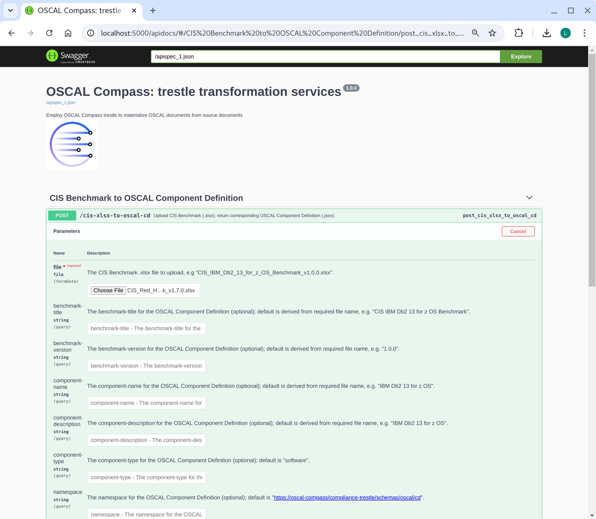
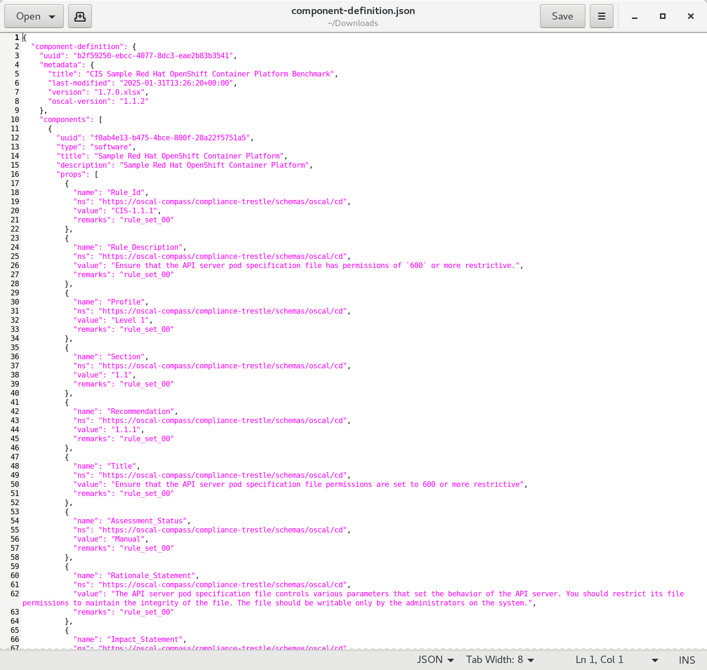

# compliance-trestle-task-cis-xlsx-to-oscal-cd-demo

Simple example of using trestle to facilitate building an OSCAL component-definition from a CIS benchmark (.xlsx)

## Prerequisites

Download this repo

```
> cd
> mkdir git
> cd git
> git clone https://github.com/IBM/compliance-trestle-demos
> cd compliance-trestle-demos
```

### Swagger demo

This swagger demo can take any CIS Benchmark (xlsx) and transform it into an OSCAL Component Definition (json).


```
> make
=> create python virtual environment
=> install prereqs
echo "=> launch flask"
source /tmp/venv.trestle/bin/activate
python apps/trestle-services/app.py

=> launch flask
 * Serving Flask app 'app'
 * Debug mode: on
WARNING: This is a development server. Do not use it in a production deployment. Use a production WSGI server instead.
 * Running on http://127.0.0.1:5000
Press CTRL+C to quit
 * Restarting with stat
 * Debugger is active!
 * Debugger PIN: 142-906-892

```

```
In web browser, enter: http://localhost:5000/apidocs/

- click on POST
- click on "Try it out"
- click on "Choose File"
- navigate to: git/compliance-trestle-demos/CIS_Red_Hat_OpenShift_Container_Platform_Benchmark_v1.7.0.xlsx
- click on Execute (blue bar)
- click on "Download file"
```

<p style="color:red;">Note: The sample CIS Benchmark is just a small snippet of the actual CIS Benchmark</p>



<br>
<br>




### Command line demo

This command line demo takes a sample CIS Benchmark (xlsx) and uses the trestle command line to transform into an OSCAL Component Definition (json)

- Install compliance-trestle, ideally in a python virtual environment.

```
> python -m venv venv.compliance-trestle-demos
> source venv.compliance-trestle-demos/bin/activate
> pip install compliance-trestle
```

- Running the demo

```
> mkdir trestle-workspace
> cd trestle-workspace
> trestle init
> trestle task cis-xlsx-to-oscal-cd -c  ../cis-xlsx-to-oscal-cd.snippet.config
input: /tmp/tmp39ynmxp5/CIS_Red_Hat_OpenShift_Container_Platform_Benchmark_v1.7.0.csv
output: component-definitions/CIS_Red_Hat_OpenShift_Container_Platform_Benchmark_v1.7.0/component-definition.json
Task: cis-xlsx-to-oscal-cd executed successfully.
```

- Viewing the result

```
> cat component-definitions/CIS_Red_Hat_OpenShift_Container_Platform_Benchmark_v1.7.0/component-definition.json 
{
  "component-definition": {
    "uuid": "4f1772a7-dcc6-4323-a7a7-725b19dd2a1a",
    "metadata": {
      "title": "CIS Red Hat OpenShift Container Platform Benchmark",
      "last-modified": "2025-01-28T21:24:02+00:00",
      "version": "1.7.0",
      "oscal-version": "1.1.2"
    },
    "components": [
      {
        "uuid": "9f3a08f3-50ca-4885-be7a-26f3643a6d5b",
        "type": "software",
        "title": "Red Hat OpenShift Container Platform",
        "description": "Red Hat OpenShift Container Platform",
        "props": [
          {
            "name": "Rule_Id",
            "ns": "https://oscal-compass/compliance-trestle/schemas/oscal/cd",
            "value": "CIS-1.1.1",
            "remarks": "rule_set_00"
          },
          {
            "name": "Rule_Description",
            "ns": "https://oscal-compass/compliance-trestle/schemas/oscal/cd",
            "value": "Ensure that the API server pod specification file has permissions of `600` or more restrictive.",
            "remarks": "rule_set_00"
          },
          {
            "name": "Profile",
            "ns": "https://oscal-compass/compliance-trestle/schemas/oscal/cd",
            "value": "Level 1",
            "remarks": "rule_set_00"
          },
          {
            "name": "Section",
            "ns": "https://oscal-compass/compliance-trestle/schemas/oscal/cd",
            "value": "1.1",
            "remarks": "rule_set_00"
          },
    ...
```
